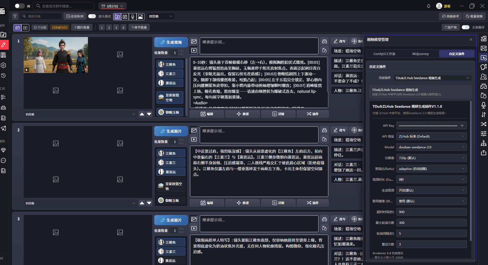
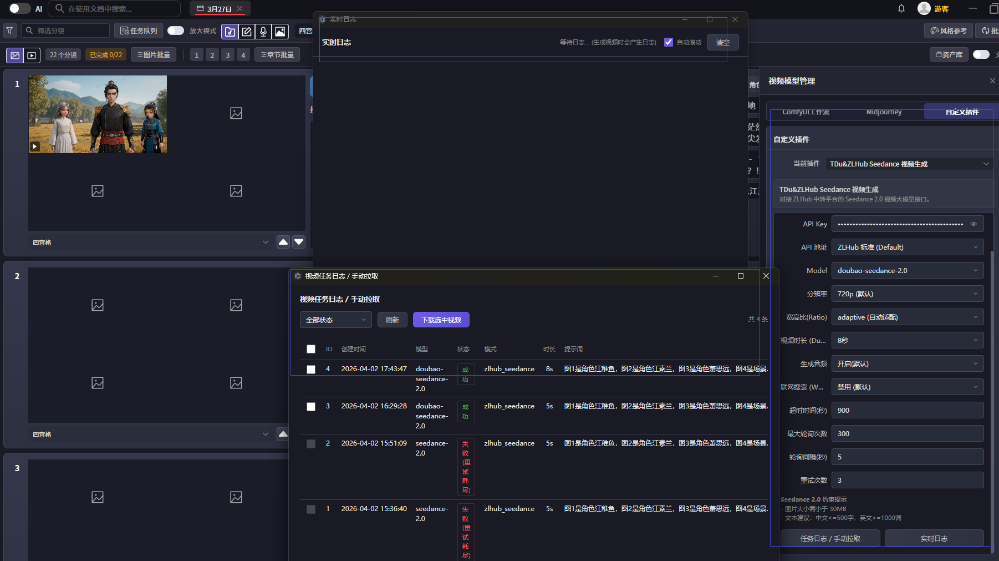

# 字字动画视频插件集合（ZLHub Seedance）

本仓库用于维护 `字字动画.exe` 生态下的视频生成插件，当前重点为 `video_plugin_zlhub_seedance`（Seedance 2.0）。

## 项目简介

- 插件类型：Python 插件
- 目标能力：提交任务 -> 轮询状态 -> 下载视频
- 约束：不修改宿主程序，仅通过插件能力扩展

## 仓库结构

- `video_plugin_zlhub_seedance/`：ZLHub Seedance 2.0 插件实现（`main.py` + `ui/`）
- `video_plugin_geeknow/`：参考插件
- `video_plugin_zzdhapi/`：参考插件
- `docs/require/`：需求与参考文档
- `docs/images/`：README 截图资源

## 安装

1. 将 `video_plugin_zlhub_seedance` 目录放到宿主插件目录下（与其他插件同级）。
2. 启动 `字字动画.exe`，在插件菜单中选择该插件。
3. 在插件配置页填写 API Key 与相关参数后保存。

## 使用

1. 在插件配置页选择模型、分辨率、时长等参数。
2. 输入提示词，执行生成。
3. 通过实时日志与任务日志窗口观察任务状态、下载结果。

## 界面截图

### 插件菜单

### 日志窗口

## FAQ

### 1) 报错 `PLUGIN_ERROR:::` 是什么？

这是插件统一错误前缀，表示错误信息已经过插件层封装，可直接用于定位生成链路问题。

### 2) 为什么任务一直在轮询？

请检查 API Key、网络连通性、任务超时参数（`timeout`/`max_poll_attempts`/`poll_interval`）以及平台侧任务状态。

### 3) 图片输入有什么限制？

本插件会校验图片路径、格式与大小；过大或不支持的格式会被拒绝（错误会以 `PLUGIN_ERROR:::` 返回）。

### 4) 可以直接改宿主程序来适配吗？

本项目默认不改宿主程序，建议通过插件参数与动作路由扩展能力，保持宿主兼容性。
