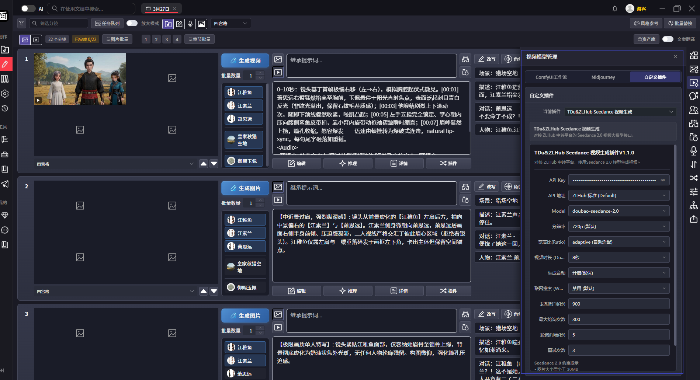
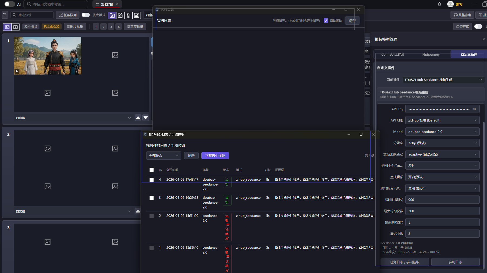

# 字字动画视频插件集合

本仓库用于维护 `字字动画.exe` 生态下的视频生成插件，覆盖 Huimeng、ZLHub、TDuHub、Shuzai 等多个 Seedance 对接平台。

## 项目简介

- 插件类型：Python 插件（`main.py` + `ui/`）
- 目标能力：提交任务 → 轮询状态 → 下载视频
- 约束：不修改宿主程序，仅通过插件能力扩展

## 插件列表

| 目录 | 说明 |
|---|---|
| `video_plugin_huimeng_seedance/` | **主力插件**：对接 Huimeng 平台 Seedance/HappyHorse 视频模型 |
| `video_plugin_zlhub_seedance/` | ZLHub Seedance 2.0 插件（V1） |
| `video_plugin_zlhub_seedance_V2/` | ZLHub Seedance 2.0 插件（V2，含审核链路） |
| `video_plugin_tduhub_seedance/` | TDuHub Seedance 插件（V1） |
| `video_plugin_tduhub_seedance_V2/` | TDuHub Seedance 插件（V2） |
| `video_plugin_shuzai_seedance/` | 数载 Seedance 2.0 插件 |
| `video_plugin_geeknow/` | GeekNow 多模型插件（参考） |
| `video_plugin_zzdhapi/` | ZZDH-API 插件（参考） |
| `ZZDH-API-seedance/` | ZZDH-API Seedance 独立插件（已废弃） |
| `docs/` | 需求文档与 API 参考 |

### 插件简介

**video_plugin_huimeng_seedance** — 当前主力插件，对接 Huimeng 中转平台，支持 happyhorse-1.0 / seedance-2.0 / seedance-2.0-fast 等多模型视频生成，配备实时日志、任务日志、参数联动和素材审核完整链路。

**video_plugin_zlhub_seedance** (V1) / **video_plugin_zlhub_seedance_V2** (V2) — 对接 ZLHub 中转平台 Seedance 2.0。V2 在 V1 基础上新增素材审核链路、TOS 临时云存储上传，`tos_ak` / `tos_sk` 固定在后端不再依赖前端输入。

**video_plugin_tduhub_seedance** (V1) / **video_plugin_tduhub_seedance_V2** (V2) — 对接 TDuHub 中转平台 Seedance。V2 同样包含素材审核与 TOS 上传链路。

**video_plugin_shuzai_seedance** — 基于 ZLHub 插件改造，适配数载平台任务接口，禁用 `GET /v1/videos/{task_id}/content` 下载端点，仅走轮询 + 结果下载通道。

**video_plugin_geeknow** — GeekNow 多模型中转插件，作为参考实现。

**video_plugin_zzdhapi** — ZZDH-API 视频生成插件，作为参考实现。

## 仓库结构

```
zz-video-plugins/
├── video_plugin_huimeng_seedance/   # 主力插件
├── video_plugin_zlhub_seedance/     # ZLHub V1
├── video_plugin_zlhub_seedance_V2/  # ZLHub V2（含审核链路）
├── video_plugin_tduhub_seedance/    # TDuHub V1
├── video_plugin_tduhub_seedance_V2/ # TDuHub V2（含审核链路）
├── video_plugin_shuzai_seedance/    # 数载 Seedance
├── video_plugin_geeknow/            # GeekNow（参考）
├── video_plugin_zzdhapi/            # ZZDH-API（参考）
├── ZZDH-API-seedance/               # （已废弃）
├── docs/                            # 需求文档与 API 参考
└── .planning/                       # 项目规划（ROADMAP、阶段计划等）
```

## video_plugin_huimeng_seedance 详解

### 支持模型

`happyhorse-1.0`、`seedance-2.0-value`、`seedance-2.0-fast-value`、`seedance-2.0`、`seedance-2.0-fast`

各模型的能力约束（分辨率、宽高比、时长范围、音频/真人审核支持）由 `MODEL_CONSTRAINTS` 统一定义，UI 和后端双重校验。

### 参数联动机制

1. **UI 层** (`ui/index.html`)：`PluginSDK.saveParam(...)` 持久化所有参数，`syncByModel()` 按所选模型动态限制可选值。
2. **后端层** (`main.py`)：`generate(context)` → `get_params()` / `context["plugin_params"]` → `_sanitize_params(...)` 归一化 → `_build_payload(...)` 构造请求体。
3. **请求体结构**：
```json
{
  "model": "seedance-2.0",
  "params": {
    "prompt": "...",
    "ratio": "16:9",
    "duration": 5,
    "resolution": "720p",
    "generate_audio": true,
    "human_review": false,
    "reference_images": ["https://..."]
  }
}
```

### 轮询策略

- 任务创建后**先等待 180 秒（3 分钟）**再开始首次查询
- 后续每隔 **180 秒（3 分钟）**查询一次
- 默认最大轮询次数 180 次（约 9 小时窗口）
- 参数 `initial_poll_delay` / `poll_interval` / `max_poll_attempts` 均可在 UI 调整

### 输入归一化

`_normalize_multi_value_input(...)` 统一处理参考素材（images/videos/audios）的多种入参格式：

- 标准数组：`["path1", "path2"]`
- 对象序号形式：`{0: "path1", 1: "path2"}`
- JSON 字符串形式：`"{\"0\":\"path1\"}"`
- 单个值（字符串）：`"path1"`

归一化后本地图片自动上传至图床，远程 URL 直接透传。

### 动作 API（handle_action）

插件通过 `handle_action(action, data)` 向前端暴露以下动作：

| 动作 | 说明 | 返回 |
|---|---|---|
| `open_live_logs` | 打开实时日志页面 | `{"ok": true, "open_page": "live_log.html"}` |
| `open_task_logs` | 打开任务日志页面 | `{"ok": true, "open_page": "task_log.html"}` |
| `get_logs` | 获取实时日志缓冲 | `{"ok": true, "entries": [...]}` |
| `get_task_logs` | 按条件查询任务日志 | `{"ok": true, "logs": [...]}` |

`get_logs` 支持 `since_index` 参数实现增量拉取；`get_task_logs` 支持 `status` 过滤和 `limit` 分页。

### 日志体系

插件有三套日志通道：

| 通道 | 存储位置 | 查看方式 | 特点 |
|---|---|---|---|
| **实时日志** | 内存缓冲 `_log_buffer`（maxlen=2000） | 插件界面「实时日志」按钮 | 进程内可见，重启丢失 |
| **文件日志** | `logs/debug_runtime_*.log` | 文件系统 | 持久化，与实时日志内容基本一致 |
| **任务日志** | `video_task_logs.db`（SQLite） | 「任务日志/手动拉取」按钮 | 任务级记录：状态、task_id、video_url、error |

**全链路事件覆盖**（均同时写入实时日志和文件日志）：

| 事件 | 说明 |
|---|---|
| `reference_input.normalized` | 参考素材归一化（字段名 + 原始类型 + 归一化数量） |
| `create_task.request` | 创建任务请求（含 endpoint + 完整 payload） |
| `create_task.success` | 任务创建成功（含 task_id） |
| `create_task.failed` | 任务创建失败（含 HTTP 状态码 + 响应文本） |
| `poll_task.attempt` | 每次轮询状态（含 attempt/max_attempts/http_status/status） |
| `poll_task.completed` | 轮询成功（含 video_url + 完整响应） |
| `poll_task.failed` | 平台返回失败（含 error_message） |
| `workflow.success` | 工作流最终成功（含 task_id/video_url/output_path） |
| `workflow.failed` | 工作流最终失败（含 task_id/error） |

## 安装

1. 将 `video_plugin_huimeng_seedance` 目录放到宿主插件目录下（与其他插件同级）。
2. 启动 `字字动画.exe`，在插件菜单中选择该插件。
3. 在插件配置页填写 API Key 与相关参数后保存。

## 使用

1. 在插件界面选择模型、分辨率、时长等参数。
2. 输入提示词，执行生成。
3. 通过「实时日志」和「任务日志」窗口观察任务状态、下载结果。

## FAQ

### 通用

**Q: 报错 `PLUGIN_ERROR:::` 是什么？**

插件统一错误前缀，表示错误信息已经过插件层封装，可直接用于定位生成链路问题。

**Q: 为什么任务一直在轮询？**

检查 API Key、网络连通性、轮询参数（`timeout`/`max_poll_attempts`/`poll_interval`）以及平台侧任务状态。默认首次查询前会等待 3 分钟。

**Q: 图片输入有什么限制？**

本插件会校验图片路径；本地图片自动上传至图床。过大或不受支持的格式会被拒绝（错误以 `PLUGIN_ERROR:::` 返回）。

### 问题排查

**Q: 报错「输入的图片中有真人敏感信息」**

需要在插件界面开启**真人审核（human_review）**开关，勾选后提交任务即可。

**Q: 参考图片报错「参考图片不存在」**

可能原因：宿主传入的 `reference_images` 格式为非数组（如对象 `{0:...,1:...}`）。当前版本已兼容对象/数组/JSON字符串等多种格式，若仍有问题请检查实时日志中 `reference_input.normalized` 事件的 `raw_type` 字段。

### 插件开发

**Q: 如何新增一个平台插件？**

以现有插件（如 `video_plugin_zlhub_seedance`）为模板：
1. 复制目录，修改 `get_info()` 中的 `name` / `description`
2. 修改 API endpoint、认证方式、payload 结构
3. 调整 `get_params()` 中的参数定义和 UI 表单
4. 测试「创建任务 → 轮询 → 下载」全链路

**Q: `.planning/` 目录是什么？**

项目采用 GSD（Goal-Structured Development）工作流进行规划：
- `ROADMAP.md` — 阶段路线图
- `phases/` — 各阶段的计划（PLAN.md）、上下文（CONTEXT.md）、研究（RESEARCH.md）、总结（SUMMARY.md）
- `codebase/` — 代码库分析文档（架构、技术栈、约定等）

## 界面截图

### 插件菜单



### 日志窗口


